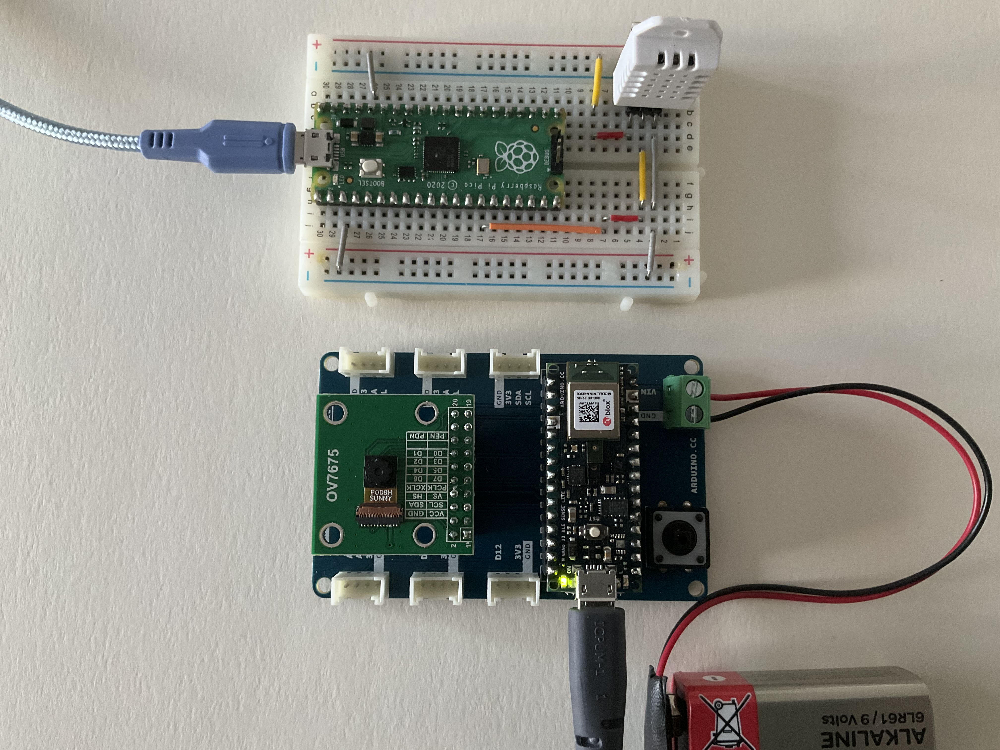

<!-- #region -->
# Building a Weather Station with TensorFlow Lite for Microcontrollers

**Final Machine Learning Project for [Kodołamacz Data Science PRO](https://datasciencepro.kodolamacz.pl/?_gl=1*f9bzqb*_ga*NzExNzQ1MTc5LjE2NzQ5NzkxMTM.*_ga_L4TZ9764GC*MTY5NTc0MTM1NS44My4wLjE2OTU3NDEzNTUuNjAuMC4w) Bootcamp**

## Description

I have been inspired by [Smart weather station challenge](https://challenge.aiforgood.itu.int/match/matchitem/71): to develop a fully functioning low-power, reliable, accurate, easy to install and maintain cost effective [weather station based on a single device](./TinyML_Challenge_2022_CSEM_report.pdf) able to detect weather parameters (temperature, pressure and humidity, wind and rain) with no moving parts based on ultra-low power machine learning at the edge, that can be deployed locally in a farm, for example, to provide local conditions and assist farmers in deciding when to plant crops. __Thus I decided to build my own microcontroller-based station to predict weather conditions in Warsaw using [TinyML system](https://www.oreilly.com/library/view/tinyml/9781492052036/).__


## Getting Started

### Dependencies

* The main content of realized machine learning project is covered within [__TinyML_project__](./TinyML_project_MDabrowski.ipynb) Jyputer notebook describing whole process of data analysis and model training. ___NOTE___: The model can be fully-implemented, trained and tested on PC but additional microcontroller is needed for model deployment.
* Hardware part to run real-time machine learning application requires [___Arduino Nano 33 BLE Sens___](https://docs.arduino.cc/hardware/nano-33-ble-sense). However, after little modifications (included in the [__Arduino_sketches__](./notebook_ArduinoSketches.ipynb) comments) the weather forecast application can be deployed on other microcontrollers e.g., [___RaspberryPi Pico___](https://www.raspberrypi.com/products/raspberry-pi-pico/) using [_Arduino IDE_](https://www.upesy.com/blogs/tutorials/install-raspberry-pi-pico-on-arduino-ide-software).
* ___Arduino Nano 33 BLE Sens___ has built-in [TPH](https://www.st.com/en/mems-and-sensors/hts221.html) sensor so we do not need external electronics components. If needed, use [DHT22](https://www.adafruit.com/product/393) sensor or similar. Then __Adafruit Unified Sensor__ (Arduino IDE library manager) and __DHT Sensor Library__ ([ZIP file](./arduino/DHT_sensor_library-1.4.4.zip) included) are necessary.
* Additional [__Arduino_sketches__](./notebook_ArduinoSketches.ipynb) Jupyter notebook contains structure of TinyML application written in C language with comments on program structure.
* __Python 3.10.6:__ For details about the version of the Python packages installed when running the [__project notebook__](./TinyML_project_MDabrowski.ipynb), see [__requirements.txt__](./requirements.txt).
* __TensorFlow Lite for Microcontrollers (TFLu)__ does not need setting up as it is included as a separate library in the Arduino IDE environment.
* [__Official tutorial__](https://docs.arduino.cc/tutorials/nano-33-ble-sense/get-started-with-machine-learning) showing how to configure the Arduino IDE, install __TFLu__ library and run first programs on ___Arduino Nano 33 BLE Sens___.

### Dataset

* I decided to use [___WorldWeatherOnline___](https://www.worldweatheronline.com/weather-api/) which is free for 30 days period and provides simple [__API__](https://www.worldweatheronline.com/weather-api/api/docs/historical-weather-api.aspx) through HTTP requests to aquire the data (including historical data from July 1, 2008) for different locations worldwide. After registering, the obtained __API key__ should be copy into [__TinyML_project__](./TinyML_project_MDabrowski.ipynb) notebook. 

```python
api_key = '<YOUR_PERSONAL_API_KEY>'  # you need to register to obtain a personal API key (FREE 500 queries/day)
```

* Alternatively, the data are downloaded as [CSV](./weather_warsaw.csv) file. The `weather_warsaw` dataset includes several weather conditions for each requested date and time. The physical quantities we are interested in to build a __TinyML__ snow forecasting application based on data from the past three hours:
<br>

 - `tempC`: the temperature in degrees Celsius
 - `humidity`: the relative air humidity in percentage
 - `totalSnow_cm`: total snowfall in centimeters


### TinyML program

* All models generated in [__TinyML_project__](./TinyML_project_MDabrowski.ipynb) Jupyter notebook are saved in `outputs` folder. Final C-byte header file should be copied into `arduino/classification` folder with TinyML application code. Other folders inside `arduino` are just for testing.
> __NOTE:__ If you use ___Arduino___ board with external __DHT22__ sensor, please use `arduino/classification_ext` folder instead.

* Please remember that ___mean___ and ___std___ of temperature and humidity extracted from __TF model__ ([__TinyML_project__](./TinyML_project_MDabrowski.ipynb)):

```python
print("COPY ME!")
print("Temperature - [MEAN, STD]  ", round(t_avg, 5), round(t_std, 5))
print("Humidity - [MEAN, STD]     ", round(h_avg, 5), round(h_std, 5))
```

&emsp;&emsp;<u>must be copied</u> into [__Arduino code__](./notebook_ArduinoSketches.ipynb) as well (here are some example values, for reference):

```C++
constexpr float t_mean  = 2.05179f;
constexpr float h_mean  = 82.30551f;
constexpr float t_std   = 7.33084f;
constexpr float h_std   = 14.55707f;
```

* After compiling (several minutes) and uploading the `classification.ino` on the board, the serial port monitor in the _Arduino IDE_ will report ___Yes, it snows___ or ___No, it does not snow___, depending on whether snow is forecast at the moment. To check if the application can forecast snow, you can simply force the temperature to -10 Celsisus degree and humidity to 100%. The model should then return ___Yes, it snows___ message on the serial port monitor.

## Help

* We use an existing [__wwo-hist__](https://pypi.org/project/wwo-hist/) wrapper to export the data to __pandas__ `DataFrame` or save them as `CSV` file. However, the wrapper file needs to be modified for __pandas__ versions <u>later than 1.3.5</u> (argument `closed` is no longer supported and needs to be removed from arguments list).

```python
def retrieve_this_location(api_key, location, start_date, end_date, frequency, response_cache_path):
    '''change just these two lines keeping the rest of the code'''
    # LINES ABOVE ...
    list_mon_begin = pd.date_range(start_date, end_date, freq='MS')  # removed: closed='right'
    list_mon_end = pd.date_range(start_date, end_date, freq='M')  # removed: closed='left'
    # LINES BELOW ...
```

&emsp;&emsp;Peplace the original `wwo_hist-0.0.7/wwo_hist/__init__.py` file on local PC by [this one](./wwo_hist-0.0.7/wwo_hist/__init__.py) with modified `retrieve_this_location()` function.

* At the end of Arduino sketches code, there is a delay of <u>two seconds</u> but is should be <u>one hour</u> in the actual application! The pause of two seconds is used to avoid waiting too long in our experiments (we have decided to predict weather in an hourly manner). Also, in the `DEBUG_SNOW` mode there are implemented conditions where model predict snowing weather (to check if the logic of Arduino application works).

```C++
#define DEBUG_SNOW 0 // replace by 1 for testing
```

* Due to [self-heating](https://forum.arduino.cc/t/how-to-make-a-weather-station-and-fix-temperature-sensor-readings-on-the-sense/624985), when the ___Arduino Nano 33 BLE Sens___ board is powered by USB, the HTS221 sensor becomes unreliable and shows an offset in each reading that changes with the external temperature. Thus, powering the board with batteries is recommended. <u>Atlernative approach:</u> use external __DHT22__ sensor and then copy the __RaspberryPi Pico__ `setup()` function from `#if-#endif` part and choose the __GPIO__ port to, for example:

```C++
const int gpio_pin_dht_pin = 13;
```



## Author

[**Michał Dąbrowski, PhD**](https://www.linkedin.com/in/mdabrowski-phd/) (see: [HarvardX TinyML Program Certificate](https://credentials.edx.org/credentials/1d5b06c62fab4a43acce960d7d841c16/))

## Version History

* __v1__
    * __v1.1__ (released: 28-SEP-2023): working version of the simple ML model deployed on ___Arduino___ board with external __DHT22__ sensor
    * __v1.0__ (released: 27-SEP-2023): first working version of the simple ML model deployed on ___Arduino___ and ___RaspberryPi___ boards

## License

This project is licensed under the **[CC BY](https://creativecommons.org/licenses/by/4.0/): Creative Commons Attribution**
This license allows reusers to distribute, remix, adapt, and build upon the material in any medium or format, so long as attribution is given to the creator. The license allows for commercial use.

## Acknowledgements

* Excelent curated list of interesting resources on TinyML (articles, courses, books, and projects) is provided on [gitHub](https://github.com/gigwegbe/tinyml-papers-and-projects) profile.

* As usually, similar [weather stations](https://github.com/FlorinAndrei/WeatherStation) were realized in the past using different microcontrollers platforms and datasets e.g., [here](https://www.seeedstudio.com/blog/2021/02/23/build-a-tinyml-smart-weather-station-with-wio-terminal/) or [there](https://www.seeedstudio.com/blog/2021/02/23/build-a-tinyml-smart-weather-station-with-wio-terminal/) thus being helpful as as a source of inspiration and code snippets.

Special acknowledgement comes to [**Pete Warden**](https://github.com/petewarden) for writting an amazing [TinyML book](https://tinymlbook.com/) and founding [HarvardX TinyML Program](https://www.edx.org/professional-certificate/harvardx-tiny-machine-learning) course. I have learned a lot!
<!-- #endregion -->
